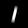
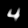
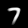

# digit-recognizer
A simple playground to establish a dev-environment. The algorithm's task is to recognize digits in segmented image data.

## Additional files
MNIST was used as dataset and need to be downloaded manually to run the program, see https://www.kaggle.com/c/digit-recognizer/ for further information

## Results

For the outcome of an unoptimized testrun see samples and KPIs in `/results/evaluation/kpi.md`

### Algorithm

This testrun simply used one feature per sample (see `classifier.extract_features()`). It is the correlation of the input data with the avg. appearance of each digit.

Below is the calculated mean appearance of these:

Below are randomly chosen samples estimated and compared with its ground truth for a better insight. Note the individual amount of samples for this database.

| Class     | amount of samples |  Visu                                                     |
|-----------|-------------------|-----------------------------------------------------------|
| 0         | 3069              |   |
| 1         | 3502              |   |
| 2         | 3172              |   |
| 3         | 3243              |   |
| 4         | 3087              |   |
| 5         | 2855              |   |
| 6         | 3095              |   |
| 7         | 3290              |   |
| 8         | 3042              |   |
| 9         | 3145              |   |

## Known limits

As this is a personal project a few things that I have in mind are not implemented. Since the code is public I want to point out that

- print outs should be replaced with a propper *logging*
- the individual algorithm parts were used with default parameters.
- no k-fold cross validation, as a fair definition for the convolution feature needs to be defined first.
- missing tests, comments and review
